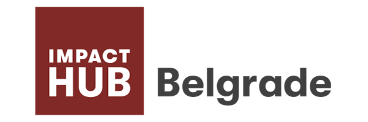

# activist

[](https://github.com/activist-org/activist)
[](https://github.com/activist-org/activist/issues)
[](https://github.com/activist-org/activist/discussions)
[](https://github.com/activist-org/activist/tree/main/frontend)
[](https://github.com/activist-org/activist/tree/main/backend)
[](https://github.com/activist-org/activist/blob/main/LICENSE.txt)
[](https://github.com/activist-org/activist/blob/main/.github/CODE_OF_CONDUCT.md)

### An open-source, nonprofit activist network

[**activist.org**](http://activist.org/) is a network for sociopolitical action that allows people the world over to coordinate and collaborate on the issues that matter most. The current goal is the creation of a central platform to find and discover political events and organizations.

<a id="contents"></a>

# **Contents**

- [Contributing](#contributing)
- [Designs](#designs)
- [Overview](#overview)
  - [Organizations](#organizations)
  - [Activists](#activists)
  - [Events](#events)
  - [Issues](#issues)
  - [Levels](#levels)
  - [Affiliates](#affiliates)
  - [Resources](#resources)
  - [Votes](#votes)
- [Supported By](#supported-by)

<a id="contributing"></a>

# Contributing [`⇧`](#contents)

Install [Docker](https://docs.docker.com/install/) and [Docker-Compose](https://docs.docker.com/compose/). Start your virtual machines with the following shell command:

```bash
docker-compose up --build
```

If all works well, you should be able to create an admin account with:

```bash
docker-compose run backend python manage.py createsuperuser
```

See the readmes for the [frontend](https://github.com/activist-org/activist/tree/main/frontend) (Vue) and [backend](https://github.com/activist-org/activist/tree/main/backend) (Django) for in-depth information on how to get started contributing to each.

Work that is in progress or could be implemented is tracked in the [issues](https://github.com/activist-org/activist/issues) and [projects](https://github.com/activist-org/activist/projects). Please see the [contribution guidelines](https://github.com/activist-org/activist/blob/main/CONTRIBUTING.md) if you are interested in contributing to activist. Also check the [`-next release-`](https://github.com/activist-org/activist/labels/-next%20release-) and [`-priority-`](https://github.com/activist-org/activist/labels/-priority-) labels in the [issues](https://github.com/activist-org/activist/issues) for those that are most important, as well as those marked [`good first issue`](https://github.com/activist-org/activist/issues?q=is%3Aissue+is%3Aopen+label%3A%22good+first+issue%22) that are tailored for first time contributors.

<a id="designs"></a>

# Designs [`⇧`](#contents)

The [designs for activist](https://www.figma.com/file/I9McFfaLu1RiiWp5IP3YjE/activist_designs?node-id=805%3A231) are made using [Figma](https://www.figma.com). Those interest can use the [discussions](https://github.com/activist-org/activist/discussions) to make suggestions for improvements.

<a id="overview"></a>

# Overview [`⇧`](#contents)

The following sections give a general overview of the various aspects of activist.

<a id="organizations"></a>

## Organizations [`⇧`](#contents)

activist is first and foremost about organizations, with the design of the platform being tailored to their needs rather than those of individuals. The main function of organizations on activist is organizing and hosting [events](#events), but future features aim to help them achieve their goals and scale more effectively.

Organizations will eventually have the following features:

### Application

All organizations have to apply to join activist. The application process is the way that the community transparently expands, with the support for applications from organizations already on the platform serving to verify those who want to join.

### Working Groups

Working groups allow organizations to organize themselves into smaller teams for specific purposes.

### Tasks

Tasks are all the things that organizations need to do, which will be able to be organized in lists and kanban boards. Tasks can themselves be [events](#events).

### Communications

Organizations will be able to send out communications to their members (announcements) and supporters (statements).

<a id="activists"></a>

## Activists [`⇧`](#contents)

Activists, user accounts, will not be included in the MVP beyond what's needed for organizations. The main goal for this component at the start is to derive technical specifications that assure that privacy at the highest level can be provided to those users who want it, while at the same time allowing for those who want to work in the open to do so. Activism is a dangerous job for many, and the platform will respect the needs of those who do dangerous work and still want to participate. Hidden accounts is the current working idea, but it should be noted that such accounts may not be fully featured.

<a id="events"></a>

## Events [`⇧`](#contents)

Events are where things happen on activist. They are organized by [issue](#issues) and [level](#levels), with the former being the focus of the event, and the latter being the kind of participation that people attending should expect.

<a id="issues"></a>

## Issues [`⇧`](#contents)

activist includes a broad selection of issues:

|                   |                            |                             |
| :---------------- | :------------------------- | :-------------------------- |
| Environment       | Democracy                  | Accessibility and Inclusion |
| Animal Rights     | Native Rights              | Trade and Development       |
| Racial Justice    | Institutional Transparency | Emergency Relief            |
| Women's Rights    | Worker's Rights            | Nutrition                   |
| LGBTQIA+          | Refugees and Migration     | Freedom of Expression       |
| Children’s Rights | Housing and Community      | Peace and Resolution        |
| Elder Rights      | Health                     | Substance Legalization      |
| Education         | Technology and Privacy     | Other                       |

Beyond these general issues, tags will also be used to draw community attention to more specific issues.

<a id="levels"></a>

## Levels [`⇧`](#contents)

Activism levels are the kind of involvement for the event, with each being a necessary component to progress within a given issue:

- Learn
- Support
- Act

Coloration is used to easily delineate the level of a particular event, with blue being for learning, green being for supporting, and red being for acting.

<a id="affiliates"></a>

## Affiliates [`⇧`](#contents)

activist has various kinds of relationships between between organizations and activists that are collectively known as affiliations. The possible affiliations include:

- Supporter: an organization or activist that supports another
- Ally: the relationship of mutual support

What kind of affiliate an organization or activist is will determine their notifications and degrees of access to private content.

<a id="resources"></a>

## Resources [`⇧`](#contents)

Resources at the start will aggregate links to files that organizations want to organize and present to their members and the general public (if made open). Later the goal is to allow for the creation of unique hosted resources such as maps that indicate areas of interest and presentations of statistical findings from researchers.

<a id="votes"></a>

## Votes [`⇧`](#contents)

Another forthcoming feature, the Votes section would allow events to be made in relation to elections and legislation. Whether or not this section would be integrated into Events is yet to be decided. Generally the idea is that [Wikidata](https://wikidata.org) would be used as a source for votes in the various regions in which activist operates.

<a id="supported-by"></a>

# Supported By [`⇧`](#contents)

activist has received support from the following organizations as a participant in the [UNLOCK accelerator](https://www.wikimedia.de/unlock/):

<div align="center">
  <br>
    <a href="https://www.wikimedia.de/"></a>
    &nbsp;&nbsp;&nbsp;&nbsp;&nbsp;&nbsp;&nbsp;&nbsp;&nbsp;
    <a href="https://wikimedia.rs/"></a>
    &nbsp;&nbsp;&nbsp;&nbsp;&nbsp;&nbsp;&nbsp;&nbsp;&nbsp;
    <a href="https://belgrade.impacthub.net/"></a>
    &nbsp;&nbsp;&nbsp;&nbsp;&nbsp;&nbsp;&nbsp;&nbsp;&nbsp;
  <br>
</div>

<a id="disclosure"></a>

# Disclosure

activist is not directly affiliated with any corporations, political parties, governments or non-government organizations.

# References

<details><summary><strong>List of referenced codes</strong></summary>
<p>

- [cookiecutter-django-vue](https://github.com/vchaptsev/cookiecutter-django-vue) by [vchaptsev](https://github.com/vchaptsev) ([License](https://github.com/vchaptsev/cookiecutter-django-vue/blob/master/LICENSE))

</p>
</details>
