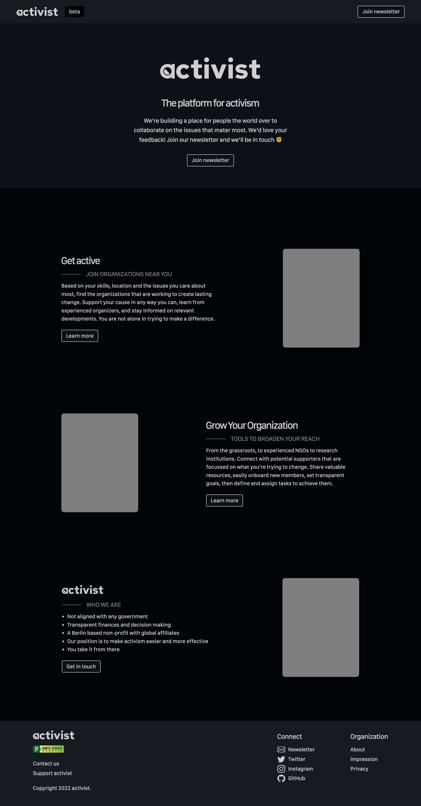
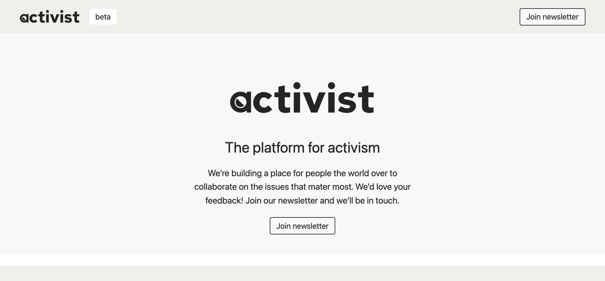
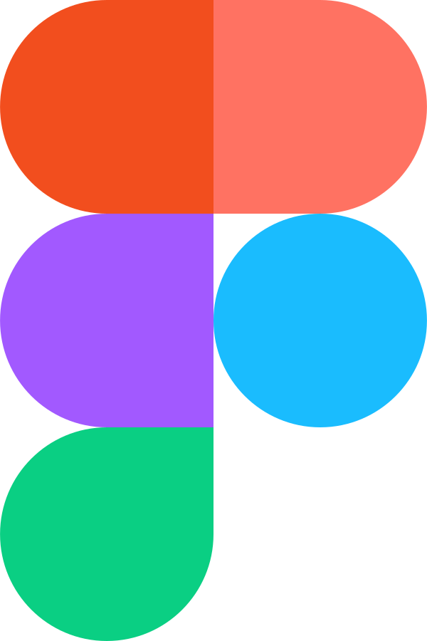
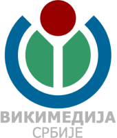
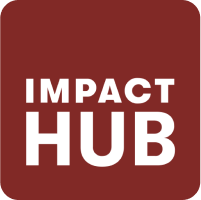

<div align="center">
  <a href="https://github.com/activist-org/activist"></a>
</div>

[](https://github.com/activist-org/activist)
[](https://github.com/activist-org/activist/issues)
[](#tech-stack)
[](#tech-stack)
[](#tech-stack)
[](https://github.com/activist-org/activist/blob/main/LICENSE.txt)
[](https://github.com/activist-org/activist/blob/main/.github/CODE_OF_CONDUCT.md)
[](https://instagram.com/activist_org)
[](https://twitter.com/activist_org)

<!-- [](https://twitter.com/activist_org)
[](https://instagram.com/activist_org) -->

<!-- Also available on [Android](https://github.com/activist-org/activist-Android) (planned) and [iOS](https://github.com/activist-org/activist-iOS) (planned). -->

### An open-source, nonprofit activist network

[**activist.org**](http://activist.org/) is a network for sociopolitical action that allows people the world over to coordinate and collaborate on the issues that matter most. The current goal is the creation of a central platform to find and discover political events and organizations.

**What does the activist `a` mean?** The center of the letter represents an arrow that points left-center from the top. This symbolizes our community and direction: that we want to work with the left and center of the political spectrum and value a democratic movement of power down to the people.

<a id="contents"></a>

# **Contents**

- [Preview Images](#preview)
- [Contributing](#contributing)
- [Platform Overview](#overview)
- [Supported By](#supported-by)

<a id="preview"></a>

# Preview [`⇧`](#contents)

The following is a screenshot to show the current progress of the development:

<div align="center">
  <kbd>
  <a href="https://github.com/activist-org/activist/blob/main/.github/resources/images/dark_landing_page_preview.png#gh-dark-mode-only"></a>
  <a href="https://github.com/activist-org/activist/blob/main/.github/resources/images/light_landing_page_preview.png#gh-light-mode-only"></a>
  </kbd>
</div>

<a id="contributing"></a>

# Contributing [`⇧`](#contents)

Work that is in progress or could be implemented is tracked in the [issues](https://github.com/activist-org/activist/issues) and [projects](https://github.com/activist-org/activist/projects). Please see the [contribution guidelines](https://github.com/activist-org/activist/blob/main/CONTRIBUTING.md) if you are interested in contributing to activist. Also check the [`-next release-`](https://github.com/activist-org/activist/labels/-next%20release-) and [`-priority-`](https://github.com/activist-org/activist/labels/-priority-) labels in the [issues](https://github.com/activist-org/activist/issues) for those that are most important, as well as those marked [`good first issue`](https://github.com/activist-org/activist/issues?q=is%3Aissue+is%3Aopen+label%3A%22good+first+issue%22) that are tailored for first time contributors.

After your first few pull requests organization members would be happy to discuss granting you further rights as a contributor, with a maintainer role then being possible after continued interest in the project. activist seeks to be an inclusive and supportive organization. We'd love to have you on the team!

## Ways to Help [`⇧`](#contents)

- [Reporting bugs](https://github.com/activist-org/activist/issues/new?assignees=&labels=bug&template=bug_report.yml) as they're found 🐞
- Working on [new features](https://github.com/activist-org/activist/issues?q=is%3Aissue+is%3Aopen+label%3Afeature) ✨
- [Localization](https://github.com/activist-org/activist/issues?q=is%3Aissue+is%3Aopen+label%3Alocalization) for the platform 🌐
- [Documentation](https://github.com/activist-org/activist/issues?q=is%3Aissue+is%3Aopen+label%3Adocumentation) for onboarding and project cohesion 📝
<!-- - [Sharing activist.org](https://github.com/activist-org/activist/issues/181) with others! 🚀 -->

### Road Map

The activist road map can be followed in the organization's [project board](https://github.com/orgs/activist-org/projects/1) where we list the most important issues along with their priority, status and an indication of which sub projects they're included in (if applicable).

<a id="tech-stack"></a>

## Tech Stack [`⇧`](#contents)

### Backend

- [Django](https://www.djangoproject.com/) • [PostgreSQL](https://www.postgresql.org/) • [Redis](https://redis.io/) • [Celery](https://docs.celeryq.dev/en/stable/)

### Frontend

- [React](https://reactjs.org/) (planned) • [TailwindCSS](https://tailwindcss.com/) • [esbuild](https://esbuild.github.io/)

### Analytics

- [Matomo](https://matomo.org/) (planned)

## Environment Setup [`⇧`](#contents)

To setup your development environment, first install [Docker](https://docs.docker.com/install/) and [Docker-Compose](https://docs.docker.com/compose/).

Then clone this repository with the below command:

```bash
git clone https://github.com/activist-org/activist.git
```

Enter the created directory and start your docker images with the following:

```bash
cd activist
docker-compose up --build
# Run the following in a second terminal screen to setup the initial database.
./run manage migrate
```

You can visit <http://localhost:8000> to see the development build once the container is up and running.

## Designs [`⇧`](#contents)

<a href="https://www.figma.com/file/I9McFfaLu1RiiWp5IP3YjE/activist_designs?node-id=805%3A231"></a>

The [designs for activist](https://www.figma.com/file/I9McFfaLu1RiiWp5IP3YjE/activist_designs?node-id=805%3A231) are made using [Figma](https://www.figma.com). Those with interest can use the [issues](https://github.com/activist-org/activist/issues) to make suggestions for improvements. Design related issues are marked with the [`design`](https://github.com/activist-org/activist/issues?q=is%3Aopen+is%3Aissue+label%3Adesign) label.

Note that the linked Figma file above is the [public facing designs](https://www.figma.com/file/I9McFfaLu1RiiWp5IP3YjE/activist_designs?node-id=805%3A231). Those interested in improving them or contributing designs for new features are invited to contact the team on GitHub or via the email on the public designs welcome page. We'd love to see a sample of your work, and if everything looks good we'll schedule a time to get connected!

<a id="overview"></a>

# Platform Overview [`⇧`](#contents)

The following sections give a general overview of the various aspects of [activist.org](http://activist.org/).

## Organizations [`⇧`](#contents)

activist is first and foremost about organizations, with the design of the platform being tailored to their needs rather than those of individuals. The main function of organizations on activist is organizing and hosting [events](#events), but future features aim to help them achieve their goals and scale more effectively.

Organizations will eventually have the following features:

### Applying to join

All organizations have to apply to join activist. The application process is the way that the community transparently expands, with the support from organizations already on the platform serving to verify those who want to join. Interactions on the platform will also in some cases be limited to members of organizations. In this way we create important links of trust from organizations to other organizations, and each organization to its individual members.

### Working Groups

Working groups will allow organizations to organize themselves into smaller teams for specific purposes.

### Communications

Organizations will be able to send out communications to their members (announcements) and supporters (statements).

### Tasks

Tasks are all the things that organizations need to do, which will be able to be organized in lists and kanban boards. Tasks can themselves be events or actions needed to make sure the event is a success (see below).

<a id="events"></a>

## Events [`⇧`](#contents)

Events are where things happen on activist. They are organized by [movements](#movements), [levels](#levels) and [formats](#formats): the first being the focus of the event; the second being the kind of participation that people attending should expect; and the third being the specific kind of activity happening (see below).

<a id="movements"></a>

### Movements

activist will eventually include a broad selection of movements. From the start the platform will focus on a select few: `Environment`, `Housing and Community`, and `Refugees and Migration`. Further movements will be added later as interest from organizations and the community grows. The following are the working movements that activist could include:

|                        |                             |                            |
| :--------------------- | :-------------------------- | :------------------------- |
| Environment            | Animal Rights               | Democracy                  |
| LGTBQIA+               | Racial Justice              | Women’s Rights             |
| Children’s Rights      | Elder Rights                | Education                  |
| Health                 | Housing and Community       | Refugees and Migration     |
| Labor Rights           | Technology and Privacy      | Peace and Resolution       |
| Nutrition              | Accessibility and Inclusion | Institutional Transparency |
| Substance Legalization | Freedom of Expression       | Emergency Relief           |

<br/>
Beyond these general movements, tags will also be used to draw community attention to more specific issues.

<a id="levels"></a>

### Levels

Activism levels are the kind of involvement for the event, with each being a necessary component to progress within a given issue. `Act` and `Learn` are the two levels of an event on activist, with coloration being used to easily delineate the level of a particular event (red is for act and blue is for learn).

<a id="formats"></a>

### Formats

Levels are further broken down into specific formats. The available formats currently include:

- Act: protest, volunteer, organize, fundraising
- Learn: seminar, webinar, meeting, panel discussion

Formats are not required for events like movements and levels, but add an optional level of granularity to help people find what they're looking for.

## Resources [`⇧`](#contents)

Resources at the start will aggregate links to files that organizations want to organize and present to their members and the general public (if made open). Later the goal is to allow for the creation of unique hosted resources such as maps that indicate areas of interest and presentations of statistical findings from researchers.

## Activists [`⇧`](#contents)

Activists, user accounts, will not be included in the MVP beyond what's needed for organization management. The main goal for this component at the start is to derive technical specifications that assure that privacy at the highest level can be provided to those users who want it, while at the same time balancing features needed by the community. Activism is a dangerous job for many, and the platform will respect the needs of those who need anonymity in their work and still want to participate.

## Affiliations [`⇧`](#contents)

activist has various kinds of relationships between organizations and activists that are collectively known as affiliations. The possible affiliations include:

- Supporter: an organization or activist that supports another
- Ally: the relationship of mutual support

What kind of affiliate an organization or activist is will determine their notifications and degrees of access to private content.

## Votes [`⇧`](#contents)

Another forthcoming feature, the votes section would allow events to be made in relation to elections and legislation. Generally the idea is that [Wikidata](https://wikidata.org) would be used as a source for votes in the various regions in which activists operate.

<a id="supported-by"></a>

# Supported By [`⇧`](#contents)

activist has received support from the following organizations as a participant in the [UNLOCK accelerator](https://www.wikimedia.de/unlock/):

<div align="center">
  <br>
    <a href="https://www.wikimedia.de/"></a>
    &nbsp;&nbsp;&nbsp;&nbsp;&nbsp;&nbsp;&nbsp;&nbsp;&nbsp;
    <a href="https://wikimedia.rs/"></a>
    &nbsp;&nbsp;&nbsp;&nbsp;&nbsp;&nbsp;&nbsp;&nbsp;&nbsp;
    <a href="https://belgrade.impacthub.net/"></a>
    &nbsp;&nbsp;&nbsp;&nbsp;&nbsp;&nbsp;&nbsp;&nbsp;&nbsp;
  <br>
</div>

<a id="disclosure"></a>

# Powered By

### Contributors

Many thanks to all the [activist.org contributors](https://github.com/activist-org/activist/graphs/contributors)! 🚀

<!-- <a href="https://github.com/activist-org/activist/graphs/contributors">
  
</a> -->

### Code

<details><summary><strong>List of referenced code</strong></summary>
<p>

- [docker-django-example](https://github.com/nickjj/docker-django-example) by [nickjj](https://github.com/nickjj) ([License](https://github.com/nickjj/docker-django-example/blob/main/LICENSE))

</p>
</details>

# Disclosure

activist is not directly affiliated with any corporations, political parties, governments or non-government organizations. Our goal is to make activism easier for our community and partner organizations.
